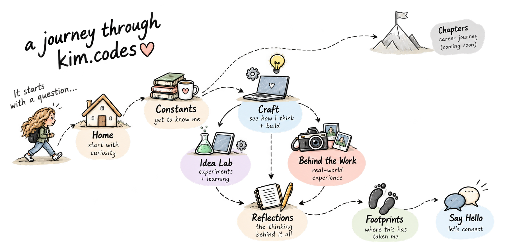

# kim.codes

I wanted to create a small space on the internet to share things like case studies, little experiments I built (and building), and just a general running record of me figuring things out. 

🔗 **live:** [kim.codes](https://kim.codes)

## the build

just plain HTML, css, js. no frameworks. this is done intentionally. I wanted to stay close to the fundamentals instead of letting a tool do the thinking for me.

The tradeoff is real. Without a framework, there's no shared component system. Things like the nav get copy/pasted and manually aded on every page. That means duplicate code, and occasional drift between pages while I'm iterating. I know... I'm working on it...

## the site in 2D

## worth noting

#### some negatives 
- css is all over the place. stylesheets, inline `<style>` tags... and tons of inconsistencies within the shared file itself. the downfall of working on the fly. 
- things like not having `:root` custom properties, colors and spacing are hardcoded in a bunch of spots instead of centralized

#### but also some positives 
- page transitions run on the native Cross-Document View Transitions API, not js. For a multi-page static site, that's the right tool for the job.
- my idea lab was/is the most fun. I learn through interaction, I want to stay true that. Most of the labs are based ideas I find fun and interesting. 

#### other 
- I try my best to keep everything in my words and tone. But sometimes that gets tough, the reality of today's world, when you want to move fast and ship things...

## status

under construction. probably always will be. 

## roadmap

tracking as much as I can in [issues](../../issues)

## License

Personal project, not licensed for reuse.

## say hello

[kim.codes/say-hello](https://kim.codes/contact.html)
